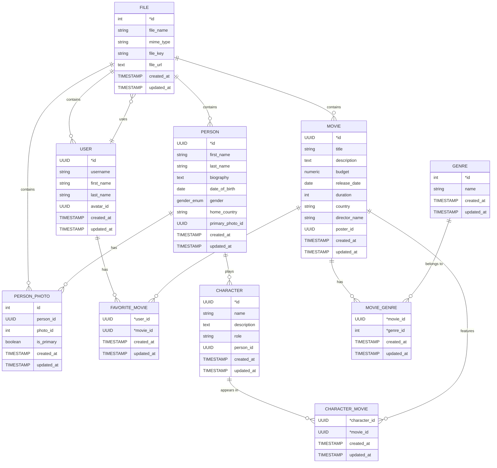

```mermaid

    erDiagram
    FILE ||--o{ USER : "contains"
    FILE ||--o{ MOVIE : "contains"
    FILE ||--o{ PERSON : "contains"
    FILE ||--o{ PERSON_PHOTO : "contains"

    USER ||--o{ FILE : "uses"
    USER ||--o{FAVORITE_MOVIE: "has"


    PERSON ||--o{ CHARACTER : "plays"
    PERSON ||--o{ PERSON_PHOTO : "has"

    CHARACTER ||--o{ CHARACTER_MOVIE : "appears in"

    MOVIE ||--o{ CHARACTER_MOVIE : "features"
    MOVIE ||--o{ FAVORITE_MOVIE : "in"
    MOVIE ||--o{ MOVIE_GENRE : "has"

    GENRE ||--o{ MOVIE_GENRE : "belongs to"

    FILE {
        int *id
        string file_name
        string mime_type
        string file_key
        text file_url
        TIMESTAMP created_at
        TIMESTAMP updated_at
    }

    USER {
        UUID *id
        string username
        string first_name
        string last_name
        UUID avatar_id
        TIMESTAMP created_at
        TIMESTAMP updated_at
    }

    CHARACTER {
        UUID *id
        string name
        text description
        string role
        UUID person_id
        TIMESTAMP created_at
        TIMESTAMP updated_at
    }

    PERSON {
        UUID *id
        string first_name
        string last_name
        text biography
        date date_of_birth
        gender_enum gender
        string home_country
        UUID primary_photo_id
        TIMESTAMP created_at
        TIMESTAMP updated_at
    }

    GENRE {
        int *id
        string name
        TIMESTAMP created_at
        TIMESTAMP updated_at
    }

    MOVIE {
        UUID *id
        string title
        text description
        numeric budget
        date release_date
        int duration
        string country
        string director_name
        UUID poster_id
        TIMESTAMP created_at
        TIMESTAMP updated_at
    }


    FAVORITE_MOVIE {
        UUID *user_id
        UUID *movie_id
        TIMESTAMP created_at
        TIMESTAMP updated_at
    }

    MOVIE_GENRE {
        UUID *movie_id
        int *genre_id
        TIMESTAMP created_at
        TIMESTAMP updated_at
    }

    CHARACTER_MOVIE {
        UUID *character_id
        UUID *movie_id
        TIMESTAMP created_at
        TIMESTAMP updated_at
    }

    PERSON_PHOTO {
        int id
        UUID person_id
        int photo_id
        boolean is_primary
        TIMESTAMP created_at
        TIMESTAMP updated_at
    }
```
